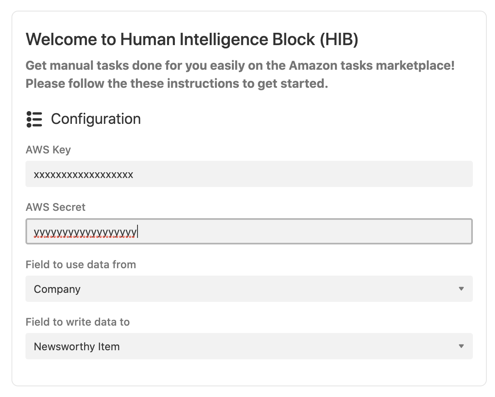
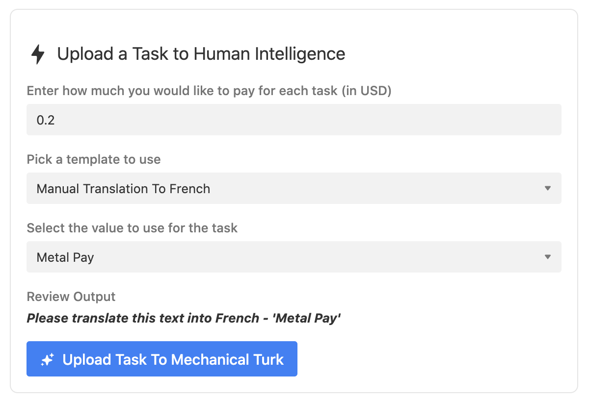
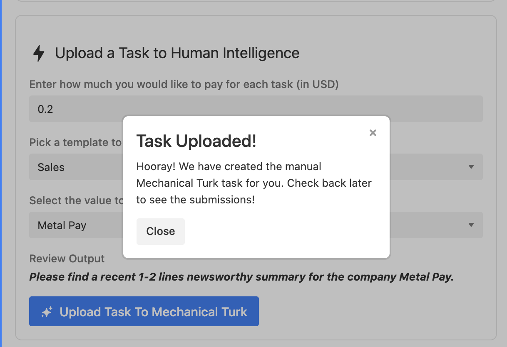
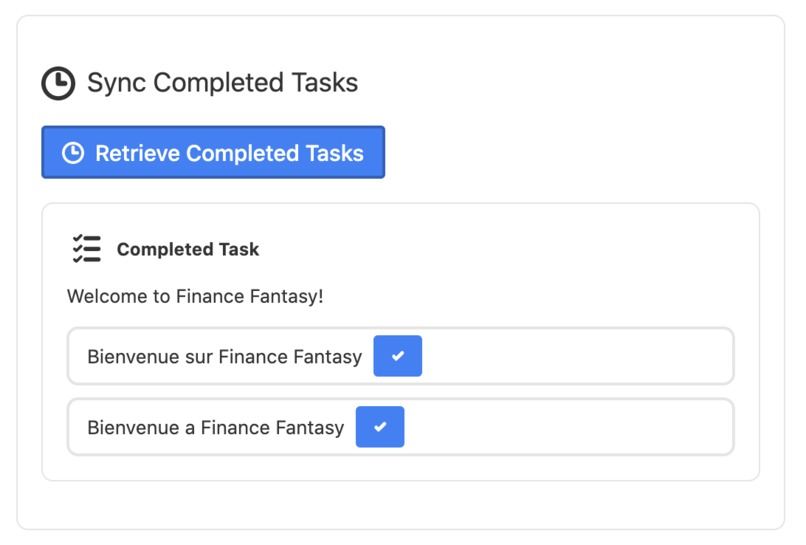
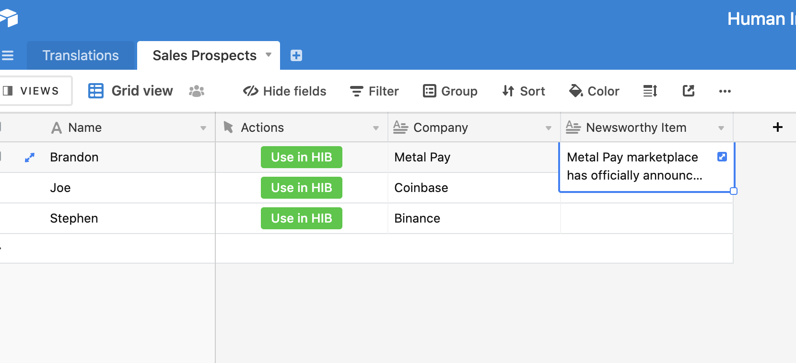
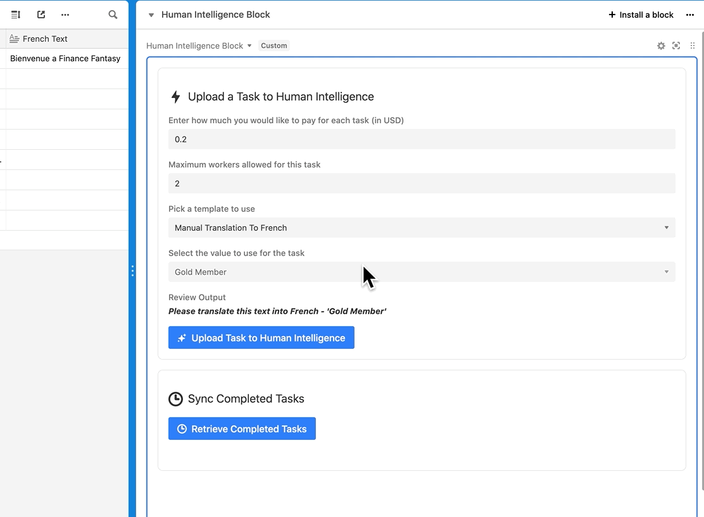

# Human Inteligence Custom Block

## Inspiration
As an indie game developer, we have limited resource as we are a small studio. Therefore, we fork out some of the small piecemeal work to third party workers via Amazon Mechanical Turk. Amazon Mechanical Turk (MTurk) is a marketplace for completion of virtual tasks that requires human intelligence. The Mechanical Turk service gives businesses access to a diverse, on-demand, scalable workforce and gives Workers a selection of thousands of tasks to complete whenever it's convenient.

Prior to discovering Airtable, we were using manual spreadsheets to keep track of tasks that the third parties on the Amazon human intelligence were doing for us and tracking the results manually, and the whole process was tedious and messy.

## What it does

With the Human Intelligence Remote Block, it is now possible to add in some manual processing by human intelligence to Airtable. The block is extensible enough to allow for many use cases that need some human intervention and processing.

We strive to eat our own dog food with a few specific use cases that we are doing:

Use Case 1.) Since we are located in Canada and there are 2 official languages (English and French), we need customized localizations for our apps and games (Google Translate doesn't do a good enough of a job. Thus we use actual humans via Amazon Mechanical Turk to help us translate our texts in the app for us.

Use Case 2.) We are constantly prospecting other companies to do partnerships with us, so we have a sales spreadsheet that we use to email prospects. What we found was that the reply rate was much higher if we can add some context about the company we're emailing, and thus our other use case involves getting a third party to do some research about a recent news/noteworthy event for that company we are looking to engage with. Again Airtable is a great help here, as it allows us to automatically create and upload tasks to Mechanical Turk and to retrieve the responses from these human intelligence workers and use it in our spreadsheet.

While building this block, we realize we need to be flexible since Airtable supports many different use cases (which is why Airtable is much better than a spreadsheet), so we created a way for people to create custom templates (ie. instructions to workers) that they can use for their use case prior to sending to Mechanical Turk. Thus, true to the spirit of Airtable, we allow users to create their own tasks that they want to post to the Mechanical Turk marketplace.

If you would like to customize the plugin (for example, ask qualifying questions before accepting workers), you can customize the logic in the server under the `airtable-server` folder. It is a standard Rails 5 application and deployment instructions are in the folder.

We are also using the newly released Button feature to activate the block so it's easy for a user to activate and upload a task easily. Just send the data to the block after you create the button and it will know what to do.

If you run into any issues, feel free to create an issue and I can try to help.

## Screenshots

# Installation
## How to remix this block

Create a new base (or you can use an existing base).

Create a new block in your base (see Create a new block, selecting "Remix from Github" as your template. Choose the folder `client`, which will have the configuration settings. For testing, you don't need to set up your own backend since the default settings will use a sandbox backend. When you are ready to move to production, you will need to deploy your own server (it's only a few lines of code, see `airtable-server` for instructions). 

From the root of client block (ie: `client`), run block run.

Afterwards, please sign up with an Amazon AWS (if you haven't done so already), and then make sure that account is linked to Mechanical Turk. Then you need to create an API key that has access to Mechanical Turk. We’ll create an IAM user with credentials that we’ll use to play around in the sandbox, but that don’t grant root access. Once the account is set up and you are signed in to your dashboard, type ‘iam’ in the AWS Services search bar. This will take you to your users dashboard; on the left hand side, go to the users menu and then click Add User. You can now set a name for this user; I recommend something obvious, like reqester_sandbox or mturk. Below that, you want to check the Enable Programmatic Access box. On the next page, you can select Attach existing policies directly (unless you want to deal with setting up groups, which can be useful if you’re managing lab members and multiple people will need the same set of permissions). Since we’re only dealing with MTurk, we don’t have to get too fancy. If you search for mechanical in the policy search bar, you’ll see one that says AmazonMechanicalTurkFullAccess. This is the policy we want to attach to this user; it gives full read and write access to MTurk. Check the box next to it and hit Review, then Create User. On this next screen, you will be presented with two very important pieces of information; the user access key, and the secret key. This is your only chance to take note of the secret key, so make a note of both of these passwords somewhere. You will need those when we configure the block.

The next step is to create an account on the MTurk requester site. Once you’ve done that, head over to the Developer tab and scroll down until you see the Link your AWS Account option. You’ll need to link these accounts together for programmatic access.

Once you have configured the above, then you can set the AWS key and secret in the configuration section in the block (click on the gears icon after you deployed your block to see the configuration screen).

## Important Note
Amazon has 2 environments for the Mechanical Turk service. Always use the development sandbox first to test your jobs, otherwise you will be charged for them when you deploy it to production.

- Sandbox login (as the admin, to create the api):
https://requestersandbox.mturk.com/developer
- Sandbox login (as a tester, to test fulfilling jobs):
https://workersandbox.mturk.com/

- Production login (as the admin):
https://requester.mturk.com/developer
- Production login (as a tester, to test fulfilling jobs):
https://worker.mturk.com/
